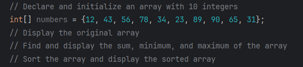

# JAVA ASSIGNMENT 
# 08-Assignment
## Array methods()
### <P>1. Which of the following is correct for declaring and initializing an array in Java?<p>
#### <P>a. Int[] arr = new int[5];<p>
#### <p>b. Int[] arr = new int(5);<p>
#### <P>c. Int[] arr = new int();<p>
#### <P>d. Int[] arr = new int{0};<P>
### <P>2. What is the correct way to find the length of an array in Java?<p>
#### <P>a. arr.size();<p>
#### <p>b. arr.length();<p>
#### <p>c. arr.length;<p>
#### <p>d. arr.getLength();<P>
### <p>3. What does the following enhanced for-loop do?<p>

#### <p>a. It prints the array in reverse order<p>
#### <p>b. It prints the index of each element of the array<p>
#### <p>c. It prints each element of the array<P>
#### <p>d. It modifies each element of the array<p>
### <p>4. How can you find the sum of all elements in an array arr in Java?<p>
#### <p>a. Int sum = Arrays.sum(arr);<p>
#### <p>b. Int sum = collections.sum(arr);<p>
#### <p>c. Int sum = 0;  for(int num : arr) sum += num;<p>
#### <p>d. Int sum = arr.sum()<p>
### <p>5. What does the Arrays.binarySearch(arr, key) method do?<p>
#### <p>a. Finds the minimum value in the array<p>
#### <p>b. Finds the maximum value in the array<p>
#### <p>c. Searches for a key in an unsorted array<p>
#### <p>d. Searches for a key in a sorted array<p>
### <p>6. What is the output of Arrays.toString(arr) where arr is an integer array?<p>
#### <p>a. The sum of the elements in the array<p>
#### <p>b. A string representation of the array elements<p>
#### <P>c. A sorted version of the array<P>
#### <P>d. An error message<P>
### <p>7. How can you copy elements from one array to another in Java?<P>
#### <p>a. Usingt arr.copy();<p>
#### <p>b. Using Arrays.copy(arr);<P>
#### <p>c. Using Arrays.copyOf(arr, length);<P>
#### <P>d. Using collections.copy(arr)<p>
### <p>8. Which method can fill an array with a specific value in Java?<p>
#### <p>a. Arrays.fill(arr, value);<p>
#### <p>b. Arrays.copy(arr,value);<p>
#### <P>c. Arrays.populate(arr,value);<P>
#### <p>d. Arr.fill(value);<P>
### <p>9. Which of the following is a valid method to compare two arrays for equality in Java?<p>
#### <P>a. Arrays.equal(arr1, arr2);<P>
#### <p>b. arr1 == arr2;<p>
#### <p>c. Arrays.equals(arr1, arr2);<P>
#### <p>d. arr1.equals(arr2);<P>
### <p>10.<p>

## Answers:
### <p>1. a. Int[] arr = new int[5];<p>
### <p>2. c. arr.length;<P>
### <p>3. c. It prints each element of the array<p>
### <p>4. c. Int sum = 0;  for(int num : arr) sum += num;<p>
### <p>5. d. Searches for a key in a sorted array<p>
### <p>6. b. A string representation of the array elements<p>
### <p>7. c. Using Arrays.copyOf(arr, length);<P>
### <p>8. a. Arrays.fill(arr, value);<p>
### <p>9. a. Arrays.equal(arr1, arr2);<p>
### <p>10.<p>
```
import java.util.Arrays;
public class AssignmentEight {
    public static void main(String[] args) {
        int[]numbers = {12,43,56,78,34,23,89,90,65,31};
            System.out.println(Arrays.toString(numbers));
            int sum = 0;
            for(int i : numbers){
                sum +=i;
            }
            System.out.println(sum);

            int min = numbers[0];
            int max = numbers[0];
            for(int i : numbers){
                if(i> max){
                    max=i;
                }
                if(i < min){
                    min=i;
                }
            }
            System.out.println("The max value of number is " + max);
            System.out.println( "The min value of number is " + min);

            Arrays.sort(numbers);
            System.out.println(Arrays.toString(numbers));

        }
    }
```
[githublink](https://github.com/Aromalpriyan/Assignment---8)